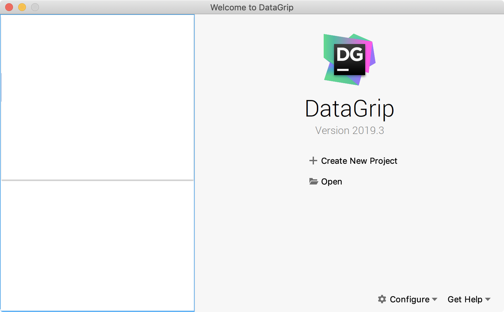
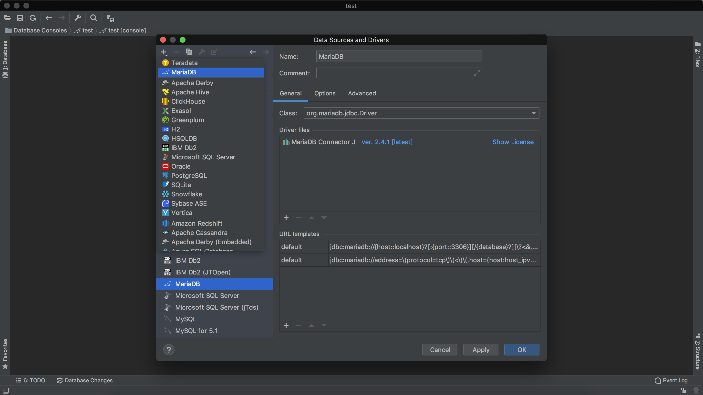
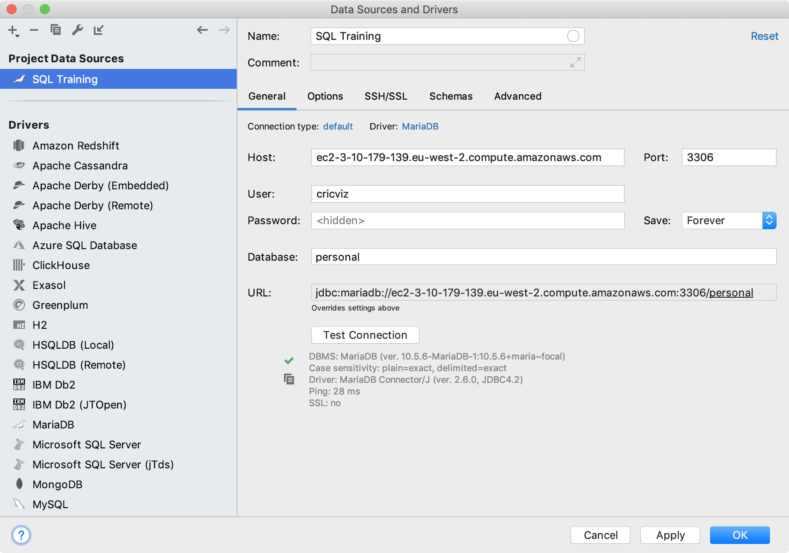
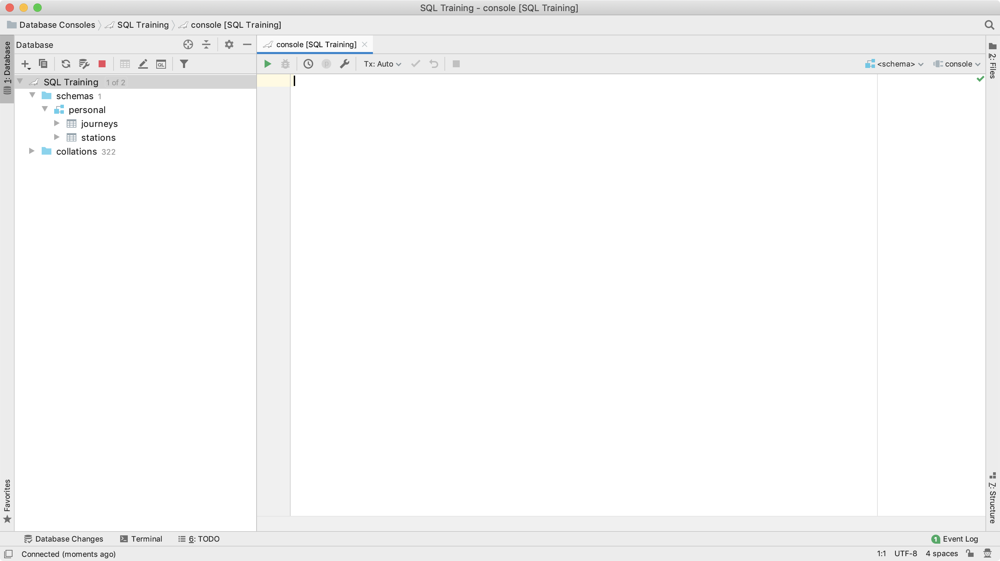

## Getting set up

You will need to install the _DataGrip_ IDE to run SQL queries on the database.  Download it from [here](https://www.jetbrains.com/datagrip/) and go through all the default installation steps for your OS.

1. You should see something like this when you open DataGrip for the first time:

2. Go to `File` at the top menu bar then click on `Data Sources...`
3. On the left, click on `MariaDB`.
4. Under `Driver files` click `Download`.
5. Then, in the top left of the same window, click on the `+` sign then select `MariaDB`:

6. Fill in the details as below:  
	Name: `SQL training`  
	Host: `flasklogs.czhfq5gyzgoo.eu-west-2.rds.amazonaws.com`  
	Port: `3306`  
	User: `apprentice`  
	Password: {I will have sent you the password}  
	Database: `personal`  

7. Click on `Test Connection`.  Note, you should be on the guest wifi for it to work.  You should see a green tick if everything has worked:  

8. Click `OK` then on the left you should see the database tables after clicking on the down arrows.

Note: you only get a 30 day free trial for DataGrip.  After this you either need to pay or use a student email address to get a full subscription.
