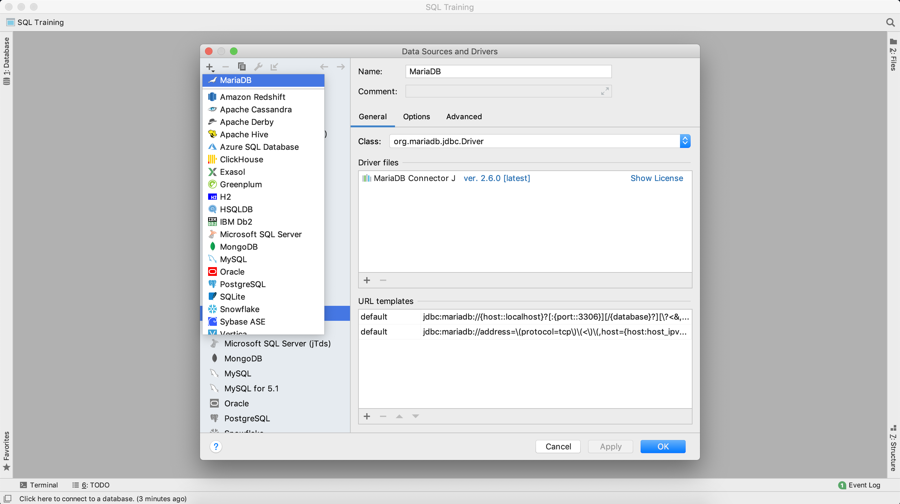

## Getting set up

You will need to install the _DataGrip_ IDE to run SQL queries on the database.  Download it from [here](https://www.jetbrains.com/datagrip/) and go through all the default installation steps for your OS.

1. You should see something like this when you open DataGrip for the first time:

2. Click on `Create New Project` and enter a name like "SQL Training".

3. Go to `File` at the top menu bar then click on `Data Sources...`

4. On the left under `Drivers`, click on `MariaDB`.

5. Under `Driver files` click `Download`.

6. Then, in the top left of the same window, click on the `+` sign then select `MariaDB`:

7. Fill in the details as below:  
	Name: `SQL Training`  
	Host: `ec2-3-10-179-139.eu-west-2.compute.amazonaws.com`  
	Port: `3306`  
	User: `cricviz`  
	Password: {I will have sent you the password}  
	Database: `personal`  

8. Click on `Test Connection`.  You should see a green tick if everything has worked:

9. Click `OK` then on the left click on the `1: Database` tab.  You should see the database tables after clicking on the down arrows.  

